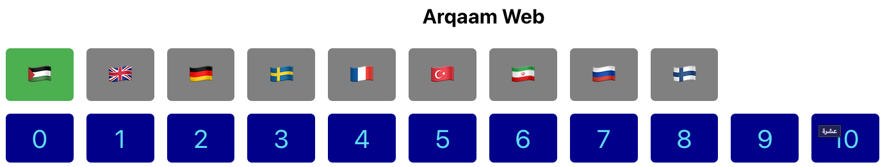

# Arqaam

Small react project to pronounce number from zero to ten in several languages.

## Languages supported
- Arabic
- English
- German
- Swedish
- Russian
- Finnish
- We are looking for more languages see How to contribute

## How to contribute
### Media files
All what is needed to support new language is 12 sound files in ACC format, 1 for the name of the language and other 11 for the numbers from 0 to 10.
#### What is needed
- A Common Creative sound files to replace some of the current not so good languages
- New sound files for new language to be supported
### Coding
Arqaam is open source project, build on NextJS 13, typescript v4.9.x and yarn 1.x
All the code is Frontend, no backend needed.
#### Setup environment
- Node 18.x or above
- yarn classic 1.x `npm i -g yarn`
- Install `yarn install`
- Build: `yarn build`
- Start: `yarn start`
### What is needed
- Support Farsi 🇮🇷, Chinese 🇨🇳, Spanish 🇪🇸
- CSS styling so website nicely aligned in all platform.
- Better quality sound files.
- Support offline mode, currently sound files cached for 24 hours.
### Deploying
Once PR merged to main branch it automatically deployed using Vercel integration tool with GitHub

## Credits
### For sound
- Arabic: [https://ttsfree.com/text-to-speech/arabic]()
- English: [https://archive.org/details/numbers0-100englishpronouciation/]()
- German: [Wiktionary DE](https://de.wiktionary.org/)
- Swedish: [Wikimedia Commons](https://commons.wikimedia.org/)
- French: [Wiktionary RU](https://fr.wiktionary.org/)
- Turkish: [www.ttsfree.com](https://ttsfree.com/text-to-speech/turkish-turkey)
- Finnish: [www.ttsfree.com](https://ttsfree.com/text-to-speech/finnish-finland#google_vignette)
- Russian: [Wiktionary RU](https://ru.wiktionary.org/)
